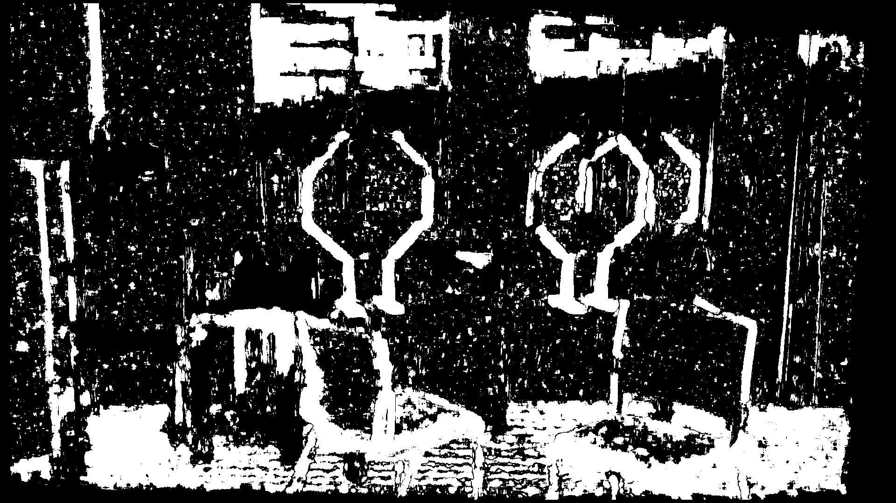

# Stereo Vision

<p align="center">
    
    
</p>


## Table of Contents
- [Overview](#overview)
- [Features](#features)
- [Installation](#installation)
- [Usage](#usage)
  - [Processing a Dataset](#processing-a-dataset)
- [Methodology](#methodology)
- [Requirements](#requirements)
- [Contributing](#contributing)
- [License](#license)
- [Acknowledgements](#acknowledgements)

## Overview

This repository provides an implementation of a **Stereo Vision** pipeline, enabling the computation of depth maps from stereo image pairs. The pipeline follows these steps:

1. **Image Acquisition**: Read stereo images and calibration parameters.
2. **Feature Matching**: Detect and match keypoints between images.
3. **Fundamental and Essential Matrices**: Compute these matrices to understand the geometric relationship between the images.
4. **Stereo Rectification**: Align the images to simplify disparity computation.
5. **Disparity Map Calculation**: Compute the disparity between rectified images.
6. **Depth Map Generation**: Convert disparity maps to depth maps for 3D perception.

## Features

- **Read Image**: Loads stereo image pairs and their calibration parameters.
- **Feature Matching**: Utilizes SIFT and FLANN for efficient and accurate feature matching.
- **Visualize Epipolar Geometry**: Draws epipolar lines to visualize the geometric relationships.
- **Stereo Rectification**: Aligns images to ensure corresponding points lie on the same horizontal line.
- **Disparity and Depth Maps**: Computes and visualizes disparity and depth information.

## Installation

### Prerequisites

- [Python 3.7+](https://www.python.org/downloads/)
- [OpenCV](https://opencv.org/) (`opencv-python` package)
- [NumPy](https://numpy.org/)
- [Matplotlib](https://matplotlib.org/)

### Steps

1. **Clone the Repository**
    ```bash
    git clone https://github.com/MayankD409/Stereo-Vision.git
    cd Stereo-Vision
    ```

2. **Create a Virtual Environment (Optional but Recommended)**
    ```bash
    python3 -m venv venv
    source venv/bin/activate  # On Windows: venv\Scripts\activate
    ```

3. **Install Dependencies**
    ```bash
    pip install -r requirements.txt
    ```

## Usage

### Processing a Dataset

To process a specific dataset (e.g., `classroom`), follow these steps:

1. **Prepare the Dataset**

    Ensure your dataset directory follows this structure:

    ```
    data/
    ├── classroom/
    │   ├── im0.png
    │   ├── im1.png
    │   └── calib.txt
    ├── storageroom/
    │   ├── im0.png
    │   ├── im1.png
    │   └── calib.txt
    └── traproom/
        ├── im0.png
        ├── im1.png
        └── calib.txt
    ```

    - `im0.png` and `im1.png` are the stereo image pairs.
    - `calib.txt` contains the calibration parameters.

2. **Run the Stereo Vision Pipeline**

    Execute the `main.py` script with the desired dataset name:

    ```bash
    python main.py --dataset classroom
    ```

    Replace `classroom` with `storageroom` or `traproom` as needed.

3. **Review the Outputs**

    The script will display:

    - **Rectified Images with Epipolar Lines**: Side-by-side visualization of rectified images with drawn epipolar lines.
    - **Disparity Map**: Both grayscale and colorized versions.
    - **Depth Map**: Both grayscale and colorized versions.

    Additionally, you can modify `utils.py` to save these outputs locally.
